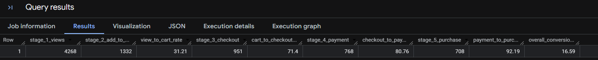
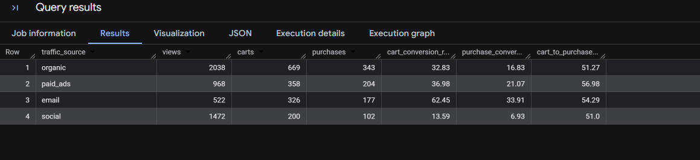
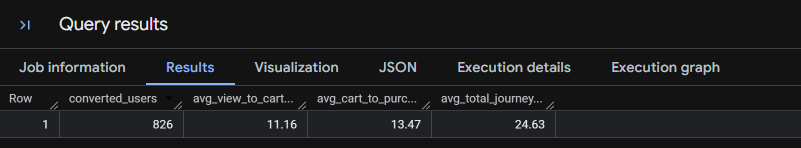
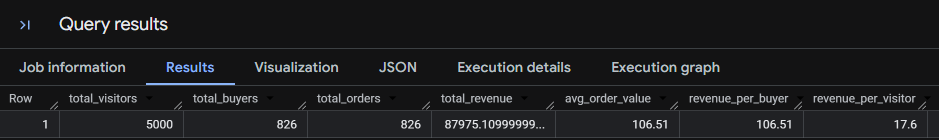

# E-commerce Sales Funnel Analysis

## Project Overview

This project analyses customer behaviour across an e-commerce sales funnel using SQL and Google BigQuery.

The dataset contains over 9,000 customer event records covering page views, add-to-cart activity, checkout, payment and purchases.

The objective was to identify where customers drop out of the sales funnel, compare conversion performance across traffic sources, analyse time-to-purchase and evaluate key revenue metrics.

## Tools Used

- SQL
- Google BigQuery
- GitHub

## Dataset

The dataset contains customer interaction data including:

- User ID
- Event type
- Event date
- Product ID
- Transaction amount
- Traffic source

The customer journey consists of five funnel stages:

1. Page View
2. Add to Cart
3. Checkout Start
4. Payment Information
5. Purchase

---

## 1. Sales Funnel Analysis

I analysed the number of unique users progressing through each stage of the sales funnel and calculated conversion rates between consecutive stages.

### Key Finding

The largest customer drop-off occurred between page view and add-to-cart, indicating that converting initial product interest into purchase intent represents the main opportunity for funnel improvement.

---

## 2. Traffic Source Analysis

I compared funnel performance across organic, paid ads, email and social traffic to understand whether high traffic volume translated into purchasing behaviour.

### Key Findings

- **Email was the highest-converting traffic source**, achieving a 62.45% view-to-cart rate and a 33.91% purchase conversion rate despite generating only 522 unique views.
- **Social generated 1,472 unique views but had the lowest purchase conversion rate at 6.93%**, indicating that high traffic volume did not translate into strong purchasing behaviour.
- **Organic generated the highest traffic volume**, with 2,038 unique views and 343 purchases.
- **Paid ads achieved a 21.07% purchase conversion rate**, outperforming organic and social on conversion efficiency.
- Cart-to-purchase conversion was relatively consistent across all four channels at approximately 51%–57%, suggesting that the largest differences in channel performance occur earlier in the customer journey.

---

## 3. Time-to-Conversion Analysis

I used timestamp analysis to measure how long converted customers took to progress through the sales journey.

The analysis measured:

- Average time from page view to add-to-cart
- Average time from add-to-cart to purchase
- Average total journey time from initial page view to purchase

This provides insight into how quickly purchasing intent develops after a customer first interacts with the website.

---

## 4. Revenue Analysis

I analysed purchasing activity and revenue performance to calculate key commercial metrics.

Metrics calculated included:

- Total visitors
- Total buyers
- Total orders
- Total revenue
- Average order value (AOV)
- Revenue per buyer
- Revenue per visitor

These metrics help connect customer funnel performance with commercial outcomes.

---

## SQL Techniques Used

The analysis demonstrates the use of:

- Common Table Expressions (CTEs)
- CASE statements
- Conditional aggregation
- COUNT and COUNT DISTINCT
- GROUP BY and HAVING
- SUM and AVG
- TIMESTAMP_DIFF
- Conversion-rate calculations
- Revenue KPI calculations

---

## Business Recommendations

Based on the analysis:

- **Prioritise improvements at the top of the funnel.** The largest drop-off occurs between page viewing and adding a product to cart, suggesting that product pages, calls-to-action, pricing or product positioning should be investigated.
- **Use email as a high-intent conversion channel.** Email traffic demonstrated the strongest purchase conversion rate and could justify further investment in customer capture, retention and email campaigns.
- **Review the quality and objectives of social traffic.** Social generated substantial traffic but had the weakest purchase conversion rate, suggesting that campaigns may be more effective for awareness than direct sales unless targeting is improved.
- **Continue evaluating paid acquisition against commercial returns.** Paid ads produced relatively strong conversion performance, but advertising costs should be compared with average order value and revenue per visitor before increasing investment.

---

## Project Files

- `ecommerce_funnel_analysis.sql` — SQL queries used to perform the analysis
- `user_events.csv` — source dataset
- `Images/` — screenshots of the analysis results
